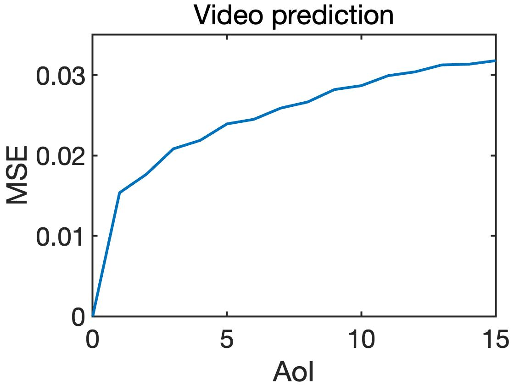
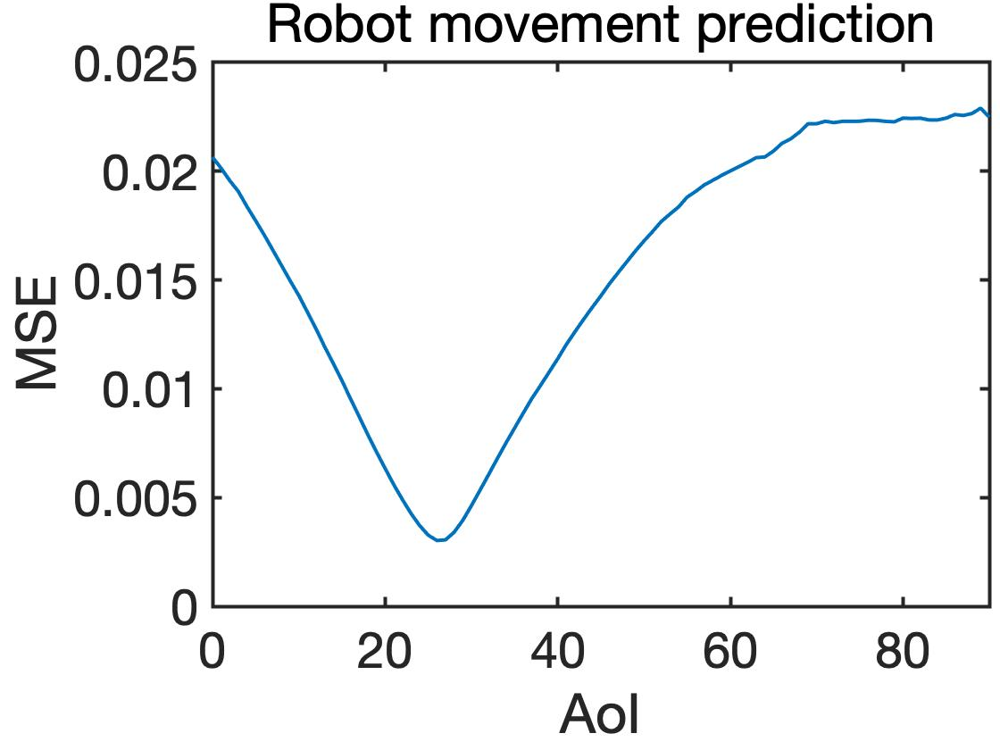
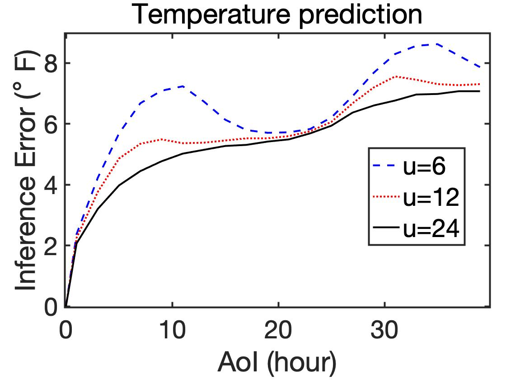
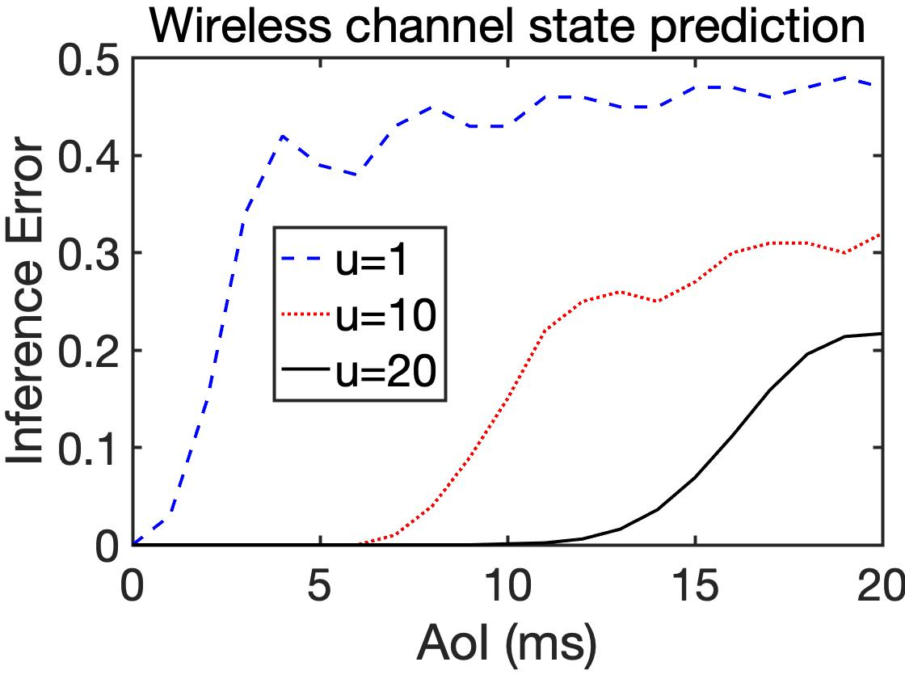
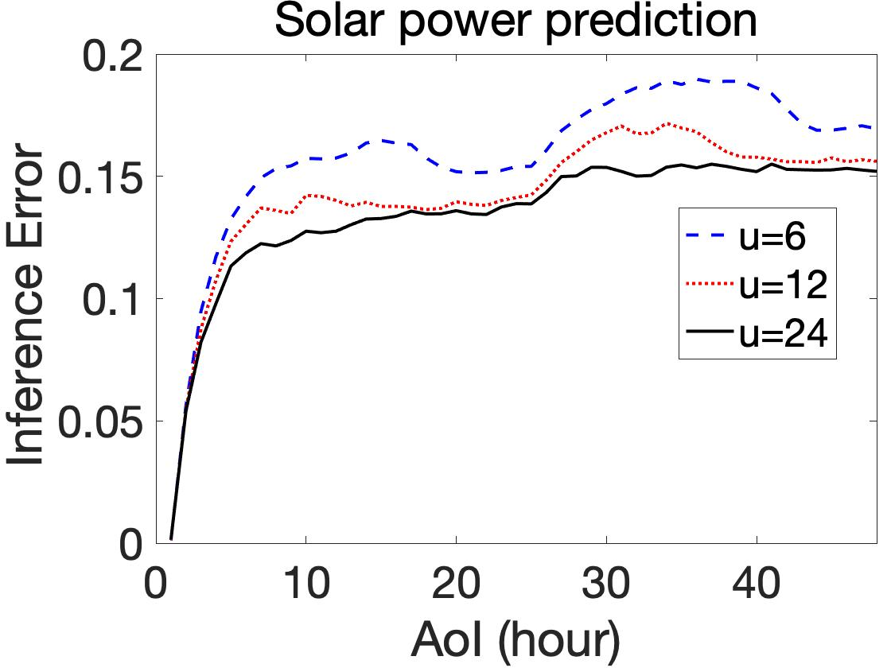

# Impact of Data Freshness in Learning

We analyze the impact of data freshness on real-time supervised learning, where a neural network is trained to infer a time-varying target (e.g., the position of the vehicle in front) based on features (e.g., video frames) observed at a sensing node (e.g., camera or lidar). 

# Motivation
In recent years, the proliferation of networked control and cyber-physical systems such as autonomous vehicle, UAV navigation, remote surgery, industrial control system has significantly boosted the need for real-time prediction. For example, an autonomous vehicle infers the trajectories of
nearby vehicles and the intention of pedestrians based on lidars and cameras installed on the vehicle. In remote surgery, the
movement of a surgical robot is predicted in real-time. These prediction problems can be solved by real-time supervised
learning, where a neural network is trained to predict a time varying target based on feature observations that are collected
from a sensing node. Due to data processing time, transmission errors, and queueing delay, the features delivered to the neural
predictor may not be fresh. The performance of networked intelligent systems depends heavily on the accuracy of realtime
prediction. Hence, it is important to understand how data freshness affects the performance of real-time supervised
learning.

To evaluate data freshness, a metric Age of information (AoI) was introduced in [1]. Let $U_t$ be the generation time of the freshest feature received by the neural predictor at time $t$. Then, the AoI of the features, as a function of time $t$, is defined as $\Delta(t) = t-U_t$, which is the time difference between the current time $t$ and the generation time $U_t$ of the freshest received feature.

One might expect that the performance of real-time supervised learning degrades monotonically as the feature becomes stale. By conducting several experiments, we show that this is not true. Experimental results show that training error and inference error can be non-monotonic functions of AoI.

# Experimental Results

  <figure>  
                 
                
                
                </figure> 


Clone the Repo:
```sh
git clone -b main https://github.com/Kamran0153/Impact-of-Data-Freshness-in-Learning.git 
cd Impact-of-Data-Freshness-in-Learning
```

Then, for different experiments, execute different python files with valid input arguments:

(a) CSI Prediction Task:

```sh
python CSI_Prediction_Task/CSIPrediction.py --u=1
```

(b) Temperature Prediction Task:
```sh
python Temperature_Prediction_Task/TemperaturePrediction.py --u=1
```
(c) Pole Angle Prediction:
```sh
python Cart_Pole_Task/PoleAnglePrediction.py --u=1
```
(d) Mountain Car State Prediction:
```sh
python Mountain_Car_Task/CarStatePrediction.py --Delay=10
```

By executing the above commands, you will get arrays of "Training Error" and "Inference Error" in '.npy' files.

To get "Training Error" and "Inference Error" for different feature size "u" and "Delay", you need to change the value. The value of "u" needs to be integer and greater than 1. The value of Delay is used only in Mountain Car State Prediction and "Delay" can be only "0, 5, 10" with the given dataset and the code. To generate figure for other values of "Delay". you need to make the dataset using "CarStateDataCollection.py" and insert the path of the dataset inside "CarStatePrediction.py".
